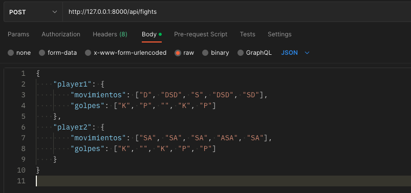

# Talana Kombat challenge

Talana Kombat es un juego donde 2 personajes se enfrentan hasta la muerte. Cada personaje tiene 2 golpes especiales que se ejecutan con una combinación de movimientos + 1 botón de golpe.

## Main dependencies

This app was coded in Python using the following dependencies:

- Django
- djangorestframework
- pytest
- pylint

## Run the project

> Run all commands on the root folder

- Build app image

```bash
docker compose build
```

- Run app container

```bash
docker compose up -d
```

- View app logs

```bash
docker logs -f talana_app
```

- Run unit tests

```bash
docker exec -it talana_app pytest -v
```

## Fight API

### Endpoint

```bash
POST http://127.0.0.1:8000/api/fights
```

### Request

Use one of the following structures as a json request

```json
{
    "player1": {
        "movimientos": ["D", "DSD", "S", "DSD", "SD"],
        "golpes": ["K", "P", "", "K", "P"]
    },
    "player2": {
        "movimientos": ["SA", "SA", "SA", "ASA", "SA"],
        "golpes": ["K", "", "K", "P", "P"]
    }
}
```

```json
{
    "player1": {
        "movimientos": ["SDD", "DSD", "SA", "DSD"],
        "golpes": ["K", "P", "K", "P"]
    },
    "player2": {
        "movimientos": ["DSD", "WSAW", "ASA", "", "ASA", "SA"],
        "golpes": ["P", "K", "K", "K", "P", "K"]
    }
}
```

```json
{
    "player1": {
        "movimientos": ["DSD", "S"],
        "golpes": ["P", ""]
    },
    "player2": {
        "movimientos": ["", "ASA", "DA", "AAA", "", "SA"],
        "golpes": ["P", "", "P", "K", "K", "K"]
    }
}
```

### Postman example



### cURL example

```bash
curl --request POST 'http://127.0.0.1:8000/api/fights' \
--header 'Content-Type: application/json' \
--data-raw '{
    "player1": {
        "movimientos": ["D", "DSD", "S", "DSD", "SD"],
        "golpes": ["K", "P", "", "K", "P"]
    },
    "player2": {
        "movimientos": ["SA", "SA", "SA", "ASA", "SA"],
        "golpes": ["K", "", "K", "P", "P"]
    }
}
'
```

### Response

```json
[
    "Tonyn se mueve y lanza una Patada",
    "Arnaldor lanza un Remuyuken",
    "Tonyn lanza un Taladoken",
    "Arnaldor se mueve",
    "Tonyn se mueve",
    "Arnaldor lanza un Remuyuken",
    "Arnaldor Gana la pelea y aun le queda 2 de energía"
]
```

---

## Preguntas

1. Supongamos que en un repositorio GIT hiciste un commit y olvidaste un archivo. Explica cómo se soluciona si hiciste push, y cómo si aún no hiciste.
   - Si aun no se hizo el push, usar el comando "amend" para añadir los cambios del stage al commit mas reciente

        ```bash
        git commit --amend --no-edit
        ```

   - Si se hizo el push, usar la instrucción anterior y para actualizar el repositorio remoto usar el siguiente comando:

        ```bash
        git push origin +[branch]
        ```

2. Si has trabajado con control de versiones ¿Cuáles han sido los flujos con los que has trabajado?
   - **main** para producción
   - **develop** para desarrollo
   - **feature/** derivados de **develop** para nuevas características a implementar
   - **fix/** derivados de **main** para arreglar problemas que se presente en producción

3. ¿Cuál ha sido la situación más compleja que has tenido con esto?

   - La mas reciente cuando tuve que arreglar un bug en producción y tuve que pasar los cambios otras ramas de desarrollo

4. ¿Qué experiencia has tenido con los microservicios?

   - Tengo experiencia implementando arquitectura de microservicios con patrones API Gateway, BFF y  Event Sourcing

5. ¿Cuál es tu servicio favorito de GCP o AWS? ¿Por qué?

    - He usado servicios de AWS como EC2, EKS, S3, Lambda y en lo personal me parece que tiene mejor soporte y documentación pero todo depende de las necesidades del negocio
